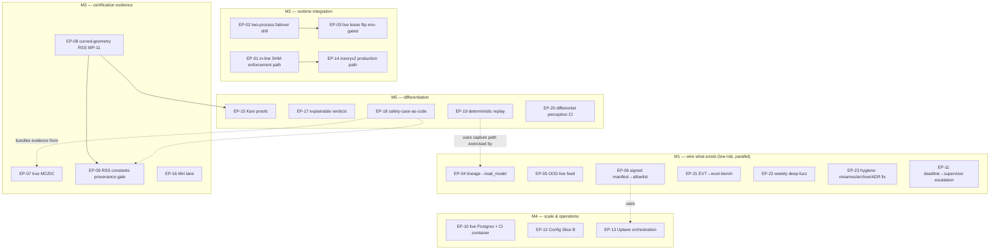

# Engineering Execution Program — from the ADAS-Benchmark DD Review

**Date:** 2026-07-08
**Authority chain:** `ADAS_BENCHMARK_GAP_ANALYSIS.md` (MGA G-1…G-22) → `ADAS_BENCHMARK_GAP_CLOSURE_PLAN.md` (WP-01…24, re-baselined §0) → `ADAS_BENCHMARK_DD_REVIEW.md` (verified statuses) → **this program** (the forward plan).
**Rule:** nothing below is scheduled because it was on the old roadmap. Every item survived a fresh impact-per-effort challenge; several old items are cancelled (§8).
**Work-package IDs:** `EP-xx` (Execution Program), to avoid collision with the historical `WP-xx`. Each EP is written to be handed to Claude Code as an independent task.

---

## 1. Executive Summary

The DD review found a codebase whose *cores* are production-grade and whose *deficit* is concentrated in four places: (1) unwired cores (six "DONE" items with zero live consumers), (2) three never-started platform WPs (in-line path, curved RSS, zero-copy adoption), (3) certification-evidence holes (MC/DC pending, VALIDATION-PENDING constants, indicative-only timing), and (4) a scalability ceiling (no real second store backend).

This program converts that finding into **five milestones over ~one quarter of focused work**:

- **M1 — Wire what exists** (≈1–2 wk): the six orphan cores gain live consumers; quick wins land. Highest value-per-line in the backlog; near-zero risk.
- **M2 — Runtime integration** (≈4–6 wk): the in-line enforcement path (EP-01) and the live lease flip behind a real two-process drill (EP-02/03). This is where "governor proxy" becomes "governor."
- **M3 — Certification evidence** (≈4–8 wk, partly parallel with M2): true MC/DC, curved-geometry RSS, the constants-provenance gate, Miri on the unsafe boundaries.
- **M4 — Scale & operations** (≈4–6 wk): live Postgres, config read-path unification, Uptane orchestration, production zero-copy.
- **M5 — Differentiation** (continuous): Kani-proved checker core, explainable verdicts, safety-case-as-code, deterministic replay — the items that make this a category of one rather than a benchmark-follower.

**Cancelled outright** (§8): SchedulingClass→syscalls under tokio, whole-store trait completion, AUTOSAR interop, CRL-file, plus newly identified hygiene debt (colliding gap-taxonomy doc, ADR-numbering collision, ambiguous test names).

North-star metric: **zero `pub` cores without a non-test consumer**, **failover ≤ 5 s demonstrated in a drill**, **MC/DC gating**, **one live non-SQLite backend**, and **at least one machine-checked proof on the actuation-path checker**.

---

## 2. Phase 1 — Validation of the DD Review

The review was re-checked against the repository before adoption. **Agreed and adopted without change:** the verified status table (§2 of the review), the quality grades, the six-orphan-cores finding, the never-started WP-11/21/21b finding, the retirement list, and the top-ranked position of the in-line path. Four points are **amended with evidence**:

| # | DD position | Amendment | Evidence & alternative |
|---|---|---|---|
| V-1 | Live lease flip is "Med-High risk; needs a live multi-node drill" (implicitly out-of-repo) | **Risk is Medium and the drill is achievable in-repo.** | `standby_monitor.rs` already supports `KIRRA_HEARTBEAT_INTERVAL`/`KIRRA_PROMOTION_TIMEOUT` env overrides and the promotion path is already CAS-fenced (`try_claim_epoch` is the guard, not the trigger). The flip changes only the *trigger*; the fence is untouched. A **two-OS-process drill** (spawn two `kirra_verifier_service` instances against one tempfile DB, kill the primary, assert the standby serves within 5 s) is buildable with `std::process` + the existing env overrides — no cluster needed. → EP-02 (drill) is scheduled *before* EP-03 (flip), and the flip ships env-gated default-off |
| V-2 | Config Slice B ranked #10 "defer" | **Upgraded to Tier 2.** | G-17's original risk was "misconfiguration class errors (wrong envelope, silent default)" — the registry/digest spine (live at boot) *detects* drift but does not *prevent* a module reading an unvalidated value. The prevention half is Slice B. Effort M, risk Low, and it parallelizes with anything |
| V-3 | Deterministic replay P(success) "Med" | **Upgraded to Med-High.** | The parts already exist and are tested: `VirtualClock`/`SharedClock` (`src/clock.rs`), `ScenarioRunner` (`src/scenario_runner.rs`), the capture wire schema + collector (`crates/kirra-capture-schema`, `kirra-collector`), and `record_from_verdict` (`kirra_core::capture`). Replay is assembly, not research |
| V-4 | "Publish the checker crates source-available" listed in the backlog | **Moved out of the engineering backlog.** | This is a licensing/business decision (see `COPYRIGHT`; `kirra-kpi-gate` is marked proprietary/`publish = false`). Engineering can *prepare* it (crate hygiene, doc coverage — already largely done) but must not schedule the decision. Flagged to ownership as **DECISION-1** |

One DD caveat is **sharpened**: MC/DC (EP-07) carries a **toolchain risk** the review understated — `cargo-llvm-cov --mcdc` requires LLVM MC/DC instrumentation support in the pinned toolchain (1.94.1). The CI job's existing fallback suggests #65 hit exactly this. EP-07 therefore starts with a 1-day toolchain spike and has an explicit fallback (branch-coverage gating + MC/DC on the checker crates only via nightly in a separate non-blocking lane).

---

## 3. Phase 2 — Dependency Graph



**Classification:**
- **Prerequisites / blocking:** EP-02 blocks EP-03 (no flip without the drill). EP-01 blocks EP-14 (zero-copy needs the in-line consumer). EP-08 feeds EP-09 (constants table must cover the curved terms) and precedes EP-15's RSS proofs (prove stable geometry, not code about to change).
- **Fully parallel / independent:** everything in M1; EP-07; EP-10; EP-12; EP-16; EP-17.
- **Risky:** EP-03 (split-brain path — mitigated by drill-first + env-gate + CAS backstop), EP-01 (new actuation-path code — mitigated by reusing the proven judge/contract patterns + WCET gate), EP-07 (toolchain), the *data-coupled* half of G-11 registry adoption (posture worker/watchdog restructure — **deliberately not scheduled**; see §8).
- **Low-risk quick wins:** EP-04/05/06/11/21/22/23 — all consume finished, tested cores.

---

## 4. Phase 3 — Prioritized Backlog

| Tier | EPs | Bar |
|---|---|---|
| **Tier 1 — Critical** (architecture incomplete without them) | EP-01, EP-02, EP-03, EP-04, EP-05, EP-06, EP-07, EP-08, EP-09 | Ships the in-line governor, real failover, wired ML trust, and the two cert-evidence holes named by the DD |
| **Tier 2 — High value** | EP-10, EP-11, EP-12, EP-13, EP-14 | Scale, ops, and the remaining runtime hardening |
| **Tier 3 — Strategic differentiation** | EP-15, EP-16, EP-17, EP-18, EP-19, EP-20 | The beyond-the-benchmark items |
| **Tier 4 — Optional** | bin decomposition (<2,000 lines), one-shot `fmt` reformat + gate, on-demand store-trait domains | Only as capacity filler; each individually justified at pickup time |

---

## 5. Phase 4 — Work Packages

### Tier 1

**EP-01 — In-line SHM enforcement path (ex-WP-21; closes G-1's software half)**
- **Goal:** the governor verdict runs *in-line* between planner output and actuator release over shared memory — not as an HTTP proxy — host-verified end to end.
- **Locations:** new `crates/kirra-inline-governor` (lib + host demo bin); consumes `kirra-contract-channel` (frozen `GovernorContractView`, seqlock), `kirra-hv-carrier` (POSIX-SHM mapping), `kirra-core::contract_consumer::GovernorCycle` (validate → `view_to_sign`), `kirra-release-token` (`contract_digest`/`issue_release_token`/`verify_release`).
- **Strategy:** (1) writer process publishes proposals into the SHM region via the existing carrier; (2) governor loop: coherent seqlock read → `GovernorCycle` validation (the same `validate_vehicle_command` path the WCET gate measures) → on ACCEPT, mint release token; (3) actuator-side stub verifies token before "release" (the ADR-0031 pattern, already implemented in `kirra-release-token`); (4) reuse the qnx-rtm-harness FDIT matrix rows as host tests (tear/bounds/CRC/replay).
- **Testing:** cross-process integration test (two processes, one SHM file) asserting: valid proposal → released with verified token; each FDIT fault class → NO release; sequence replay → reject. Latency sampled and asserted against `GOVERNOR_VERDICT_WCET_CI_THRESHOLD_MICROS` (p99.9, host-INDICATIVE label preserved).
- **Safety impact:** the load-bearing G-1 property. **Perf impact:** removes HTTP from the enforcement path. **Risk:** Med (new actuation-path assembly; every component is individually proven). **Effort:** L (2–3 wk). **Deps:** none.
- **DoD:** cross-process demo + fault-matrix tests green in CI (new `inline-governor` job); no HTTP on the enforced path; WCET gate extended to the in-line loop; README states the QNX-target step remaining.

**EP-02 — Two-process HA failover drill harness**
- **Goal:** a CI-runnable drill that spawns two real `kirra_verifier_service` processes against one SQLite file, kills the Active, and measures standby detection→promotion→first-served-request.
- **Locations:** `tests/ha_two_process_drill.rs` (spawn via `std::process::Command`, tempdir DB, `KIRRA_HEARTBEAT_INTERVAL`/`KIRRA_PROMOTION_TIMEOUT` overrides, health polls over HTTP); CI: a dedicated serial job (port allocation).
- **Testing is the deliverable.** Assert: exactly-one-Active at all times (epoch/holder polled), promotion under the legacy path within its documented bound; the harness exposes the measured failover time as output.
- **Risk:** Low-Med (process orchestration flake — mitigate with generous poll budgets and `#[ignore]`-off-by-default → dedicated CI job). **Effort:** M (0.5–1 wk). **Deps:** none. **DoD:** drill green in CI on the legacy path; measured time reported.

**EP-03 — Live lease promotion flip (env-gated; ex-WP-19 final)**
- **Goal:** the ≤5 s failover product property, delivered.
- **Locations:** `src/standby_monitor.rs` (heartbeat writer → also `renew_lease` at `LeaseParams::renew_interval_ms`; promotion monitor → trigger from `promotion_due_since_renew` when `KIRRA_HA_LEASE_ENABLED=1`); `src/env_config.rs` (+1 `EnvKeySpec`); CLAUDE.md/docs.
- **Strategy:** additive trigger only — the durable epoch CAS remains the sole authority for the actual takeover; legacy heartbeat timeout stays as fallback when the gate is off. Self-demote on `holder_must_self_demote` mirrors the existing wedge path.
- **Testing:** EP-02's drill re-run with the gate ON asserting detection→promotion ≤ 5 s and no double-Active; the existing `ha_failover.rs` store drill unchanged; lease unit suite unchanged.
- **Risk:** Med (split-brain-adjacent; bounded by drill-first, gate-off default, CAS backstop, `demote_before_promote` const-proofs). **Effort:** M (1 wk after EP-02). **Deps:** EP-02. **DoD:** drill proves ≤5 s with the gate on; default remains off until a release decision flips it; plan §0 updated.

**EP-04 — Wire `ModelLineage` into the live model-load path**
- **Goal:** a rejected model artifact triggers automatic rollback to last-good instead of a bare failure.
- **Locations:** `parko/crates/parko-onnx/src/session_core.rs` (`load_model` already calls `verify_model_file`); hold a `ModelLineage` in the backend state; on `IntegrityRejected` → `lineage.admit(...)` → `Rollback { to }` re-loads the last-good path (keep a digest→path map beside the model dir); `Deny` → fail-closed as today.
- **Testing:** backend unit tests over temp model files: good→commit/anchor; substituted→rollback loads prior file; no-known-good→deny. Existing ORT CI lane covers it.
- **Risk:** Low. **Effort:** S-M (2–4 d). **Deps:** none. **DoD:** rollback demonstrated in the ORT test lane; `LineageDecision` has a non-test consumer.

**EP-05 — Feed the OOD monitor live per-tick confidences**
- **Goal:** distribution drift escalates the effective posture, live.
- **Locations:** `parko/crates/parko-ros2` `run_pipeline_tick` (collect per-frame detection confidences into a ring window; `OodMonitor::assess` each tick; fold `recommended` via `posture.escalate(...)` exactly as the comparator does); calibration baseline loaded from a file produced by a small offline tool (`parko-core` example binary over a recorded corpus); env-gated `KIRRA_OOD_ENABLED`.
- **Testing:** tick-pipeline test rig: injected shifted-confidence stream → Degraded/LockedOut; nominal corpus → no escalation (reuse the false-positive-budget bound); absent baseline + gate on → fail-closed startup abort.
- **Risk:** Low (derate-only by construction). **Effort:** M (1 wk). **Deps:** none. **DoD:** escalation demonstrated in the rig; `ood` has a non-test consumer; env var registered.

**EP-06 — Node step: signed manifest → live allow-list**
- **Goal:** the model allow-list a parko process runs under is a *signed fact* end to end on a node.
- **Locations:** `crates/kirra-ota-installer` (`kirra-ota-ctl` gains `model-allowlist` subcommand: fetch/verify metadata via `uptane::verify_update` + `UptaneTrustStore`, emit `KIRRA_MODEL_ALLOWLIST(_STRICT)` as an env file/systemd drop-in via `model_targets::model_allowlist_env_value`); doc: the two-process wiring (verifier-side signer, node-side consumer).
- **Testing:** installer integration test: signed set → emitted env matches digests; tampered targets → no file emitted + non-zero exit; empty manifest + strict → emitted strict-deny config.
- **Risk:** Low. **Effort:** S-M (2–4 d). **Deps:** none (EP-13 later replaces the fetch stub with the full client). **DoD:** `model_targets` has a non-test consumer; drill in `docs/ota/`.

**EP-07 — True MC/DC (#65)**
- **Goal:** the coverage gate measures and *gates on* MC/DC, at minimum for the checker crates.
- **Locations:** `.github/workflows/ci.yml` coverage job; possibly `rust-toolchain.toml` interplay (nightly side-lane if the pin lacks support).
- **Strategy:** day-1 spike: run `cargo llvm-cov --mcdc` on 1.94.1; if unsupported → dedicated nightly, non-pinned MC/DC lane scoped to `kirra-trajectory`, `kirra-core`, `parko-core` (the certification-relevant crates), gating on a floor; branch coverage remains the workspace-wide gate. Rename the job so it stops advertising a pending state.
- **Testing:** the lane itself; a deliberately-uncovered decision proves the gate reds.
- **Risk:** Med (toolchain). **Effort:** M (3–5 d incl. spike). **Deps:** none. **DoD:** an MC/DC number is produced and gated for the checker crates; issue #65 closed with the decision recorded.

**EP-08 — Curved-geometry RSS (ex-WP-11; completes G-12's geometry half)**
- **Goal:** lateral/longitudinal RSS evaluated in a curved-lane Frenet frame; per-class footprint gate replaces the fixed 2.5 m band.
- **Locations:** `crates/kirra-trajectory/src/validation.rs` (+ a new `frenet.rs`: arc-length projection onto the corridor centerline polyline; lateral = signed offset); `kirra-core::corridor` (centerline accessor if absent); the `RSS_LONGITUDINAL_OVERLAP_M` gate parameterized per `KIRRA_VEHICLE_CLASS` via `contract_profiles`.
- **Strategy:** additive: straight-lane fast path preserved bit-for-bit when curvature ≈ 0 (the WCET-critical path unchanged); curved path behind the slow-loop (`validate_trajectory_slow*` only). Property tests: straight-line equivalence (curved code on zero-curvature corridor ≡ existing results); curvature monotonicity (tighter curve ⇒ never-larger admissible speed).
- **Risk:** Med (geometry subtlety — mitigated by the equivalence property + mutation gate coverage). **Effort:** M-L (1–2 wk). **Deps:** none. **DoD:** curved-corridor scenarios in the KPI corpus; equivalence + monotonicity proptests green; mutation gate covers the new arms.
- **Safety impact:** removes a known unsound simplification on curved roads.

**EP-09 — RSS constants provenance & sign-off gate**
- **Goal:** every VALIDATION-PENDING safety constant is either (a) signed off with recorded provenance or (b) mechanically visible as pending — no silent placeholder can reach a release.
- **Locations:** new `ci/safety_constants_manifest.json` (constant → value → status ∈ {validated, pending} → provenance/owner); a check (extend `kirra-kpi-gate` binary or a small `ci/` script) that greps the declared constants (`RSS_LAT_BRAKE_FRACTION`, `RSS_MU_LATERAL_M`, redundancy tolerances, `CTRV` bounds, …) match the manifest values and FAILS a *release* build (env `KIRRA_RELEASE_GATE=1`) if any is `pending`.
- **Testing:** gate reds on a mismatched value and on pending-at-release; green today (all pending, non-release).
- **Risk:** Low (the *sign-off itself* is external — a safety engineer; the gate makes that dependency visible instead of forgettable). **Effort:** S-M (2–4 d). **Deps:** EP-08 (constant list final). **DoD:** manifest + gate in CI; release path blocked on pending constants.

### Tier 2

**EP-10 — Live Postgres backend + CI service container** — implement the promised ~10-line `PgExecutor` adapter over `postgres` (sync) in a new opt-in feature/crate (`kirra-verifier-pg` or feature `pg`); run `migrations_postgres` + the `EpochFence`/`NodeStore` conformance suites against a real `services: postgres` container in a dedicated CI job; epoch fence realized transactionally (`SELECT … FOR UPDATE`). *Then stop* (wire-or-delete rule stands). Risk Low; Effort M (1 wk); DoD: conformance suites green vs live PG in CI; G-9 upgraded from "seams" to "second backend, proven."

**EP-11 — Deadline → supervisor escalation** — `DeadlineRegistry` gains a sustained-miss predicate (N misses in window, hysteresis like `recovery_hysteresis`); the telemetry-watchdog's recorder feeds it; a `Critical`-task sustained miss sends `PostureRecalcTrigger`/supervisor escalation (the C2 fail-closed path). Also deadline-record the other interval loops (campaign/cert monitors) — cheap now that the seam exists. Risk Med (control-path; escalation-only, hysteresis-guarded); Effort M (3–5 d); DoD: rig test proves sustained watchdog overrun → posture escalation; nominal jitter does not.

**EP-12 — Config Slice B: reads through `EffectiveConfig`** — route the per-module `std::env::var(KIRRA_*)` reads through the typed, validated `EffectiveConfig` snapshot (constructed once at boot, injected); unknown-key WARN becomes impossible-by-construction for migrated modules; INVARIANT #13 untouched (no set_var). Migrate incrementally: gateway/actuator envelope class, HA, monitors. Risk Low; Effort M (1–2 wk, mechanical); DoD: migrated modules have zero direct env reads (greppable), each with a test that a bad value fails at *boot*, not at use.

**EP-13 — Uptane orchestration completion (G-7 remainder)** — durable metadata persistence already exists (`UptaneTrustStore`); add the node-side update client loop in `kirra-ota-installer` (fetch metadata set → `verify_update` → persist floor → then artifact pull by authorized digest), replacing EP-06's stub fetch; wire campaign assignment to serve the signed metadata set. HSM/TPM root custody stays external. Risk Med; Effort M-L (1–2 wk); DoD: two-node rollout drill extended to full Uptane flow incl. a rollback-attack rejection.

**EP-14 — iceoryx2 production path (ex-WP-21b)** — promote the spike's carrier into a feature-gated transport for EP-01's in-line loop (same frozen contract, same judge); keep POSIX-SHM as default. Risk Med; Effort M-L; Deps EP-01. DoD: in-line drill passes over both carriers; Orin bench numbers refreshed.

### Tier 3 — Differentiation

**EP-15 — Kani proofs on the checker cores** — targets in order of tractability×value: (1) `lease.rs` invariants (`from_ttl` totality, `demote_before_promote` for all u64 — integer-only, trivial harness); (2) `kinematics_contract` clamp properties (output always within envelope; NaN → deny — bounded floats via `f64::is_finite` case-split); (3) RSS distance monotonicity on the integer-scaled forms. New `verification/kani/` + a non-blocking CI lane → blocking once stable. Risk Med (float reasoning limits — scope to provable forms honestly); Effort M-L; DoD: ≥3 machine-checked properties on actuation-path code, cited from the safety case.

**EP-16 — Miri lane** — run the enumerated-`unsafe` boundaries (`kirra-hv-carrier`, `kirra-contract-channel` seqlock tests) under Miri in CI (nightly lane, `--many-seeds` for the seqlock). Risk Low; Effort S-M; DoD: green Miri job gating those two crates.

**EP-17 — Explainable safety verdicts** — every denial already carries a `DenyCode`; add a signed *verdict record* (reuse capture schema + audit chain) and a `GET /verdicts/{id}` operator view rendering code→human explanation→inputs digest. Risk Low; Effort M; DoD: a denied actuator command is retrievable as a signed, human-readable artifact.

**EP-18 — Safety-case-as-code bundle** — a `cargo xtask`-style generator that assembles, per release: RTM matrices, SOTIF coverage output, KPI/MC campaign reports, constants manifest (EP-09), coverage numbers, loom/fuzz/mutation summaries → one versioned, hash-chained evidence bundle. Risk Low; Effort M; DoD: `make safety-case` produces the bundle in CI on tags.

**EP-19 — Deterministic replay** — assemble `capture` records + `VirtualClock` + `ScenarioRunner` into `kirra-replay`: feed a captured session back through the real gateway/governor and assert bit-identical verdicts. Risk Med; Effort M-L; DoD: capture→replay→identical-verdict test in CI; an incident-reconstruction doc.

**EP-20 — Differential perception CI** — run taj Phase-A vs Phase-B over shared synthetic ground truth (reuse the KPI corpus generators) and gate on divergence classes, extending the negative-control philosophy to perception. Risk Low; Effort M; DoD: a differential row in the KPI gate.

### Quick wins (fold into M1)

- **EP-21** — enable `evt` in `kirra-wcet-bench`; emit pWCET + i.i.d./stationarity diagnostics in the bench report (still INDICATIVE-labeled). S (1 d).
- **EP-22** — weekly scheduled deep-fuzz workflow (4–8 h across the 4 targets, corpus persisted as artifact). S (0.5 d).
- **EP-23** — hygiene: rename `audit_powerloss.rs`/`audit_power_loss.rs` → intent-revealing names; archive `GAP_CLOSURE_STATUS.md` under `docs/analysis/archive/` with a banner (its G-numbers collide with the MGA taxonomy — a real confusion hazard found during DD); fix the ADR-0001 numbering collision (`0001-occy-odd-speed-cap.md` vs `0032-governor-deployment-platform.md`). S (0.5–1 d).

---

## 6. Phase 5/6 — Milestone Roadmap & Engineering Review

| Milestone | Contents | Duration | Exit criteria (measurable) |
|---|---|---|---|
| **M1 — Wire what exists** | EP-04/05/06/11/21/22/23 (all parallel) | 1–2 wk | Zero orphan cores (every DD-flagged module has a non-test consumer); deadline escalation demonstrated; fuzz schedule live |
| **M2 — Runtime integration** | EP-01; EP-02 → EP-03; (EP-14 tail) | 4–6 wk | In-line cross-process drill green with fault matrix; failover drill measures ≤ 5 s with lease gate on; no HTTP on the enforced path |
| **M3 — Certification evidence** | EP-07, EP-08 → EP-09, EP-16 (parallel with M2) | 4–8 wk | MC/DC number gated for checker crates; curved-RSS equivalence+monotonicity proptests green; release build blocked on pending constants; Miri green |
| **M4 — Scale & operations** | EP-10, EP-12, EP-13 | 4–6 wk | Conformance suites green vs live PG in CI; migrated modules have zero direct env reads; full Uptane node flow in the two-node drill |
| **M5 — Differentiation** | EP-15, EP-17, EP-18, EP-19, EP-20 | continuous (start ≈ wk 6) | ≥3 Kani-checked properties; signed verdict artifact retrievable; `make safety-case` bundle; capture→replay identical verdicts |

**Per-milestone review:**

- **M1** — Risks: essentially none technical; the OOD baseline file format is the only design choice (keep it dumb: JSON of bin proportions). Unknowns: parko-ros2 tick-rig ergonomics. Rollback: every EP is env-gated or additive. Cert: closes the "monitored ML runtime" claim honestly. Testing: existing rigs + new unit drills.
- **M2** — Risks: EP-01 actuation-path assembly (mitigated: every part reused from proven code; FDIT matrix reused as tests); EP-03 split-brain (mitigated: drill-first, default-off, CAS untouched — rollback = flip env off). Unknowns: CI flake surface of process-spawning drills (serial job, generous budgets). Cert: G-1 software-half evidence; failover figure becomes citable. Perf: HTTP removed from enforcement; expect orders-of-magnitude latency reduction on that path (already indicated by the 91 µs verdict + spike numbers).
- **M3** — Risks: EP-07 toolchain (spike day 1; fallback lane defined); EP-08 geometry subtlety (equivalence property is the safety net). Migration: none (additive slow-loop). Cert: the two loudest assessor findings (MC/DC, placeholder constants) get mechanical answers.
- **M4** — Risks: PG semantics drift vs SQLite (conformance suites are the guard); Uptane client scope creep (bound: node flow only, custody external). Rollback: PG is opt-in feature; config migration is per-module and reversible.
- **M5** — Risks: Kani float limits (scope honestly); replay determinism leaks (clock/iteration order — `VirtualClock` + BTree ordering already the house style). None touch the hot path.

---

## 7. Estimated Timeline & Success Metrics

**Timeline (single senior engineer + Claude Code; M2/M3 partly parallel):** M1 wks 1–2 · M2 wks 2–7 · M3 wks 4–10 · M4 wks 8–13 · M5 from wk 6, continuous. **~one quarter to complete M1–M4.**

**Success metrics:**
1. Orphan-core count: 6 → **0** (greppable: every DD-listed module has a non-test consumer).
2. Failover detection→promotion: ~12 s → **≤ 5 s**, measured by EP-02's drill in CI.
3. Coverage: an **MC/DC percentage gated** for `kirra-trajectory`/`kirra-core`/`parko-core`.
4. Release gate: **0 VALIDATION-PENDING constants** reachable in a release build.
5. Backends: **2 live store backends** passing one conformance suite in CI.
6. Proofs: **≥ 3 Kani-checked properties** on actuation-path code.
7. DD score deltas to re-verify at program end: Scalability 4→6, Certification Readiness 4→6, Production Readiness 5→7, Overall 6.5→**7.5**.

---

## 8. Phase 7 — Work Removed / Retired (with cause)

| Item | Action | Cause |
|---|---|---|
| `SchedulingClass` → `SCHED_FIFO`/affinity syscalls under tokio | **Cancelled** (enum stays as metadata) | Wrong layer: tokio multiplexes tasks over shared workers; per-task RT scheduling is unimplementable there. RT intent re-homed to the dedicated-thread/QNX lane (EP-01/EP-14 successors) |
| Whole-store `VerifierStorage` trait (~130 methods) | **Cancelled as a goal** | Two domains proved the pattern; further extraction without a consumer is ceremony. Wire-or-delete rule: new domain trait ⇒ ships with a consumer or the EP-10 milestone |
| G-22 AUTOSAR interop | **Removed from active plan** | Customer-driven; zero pull signal; revisit on a signed requirement |
| CRL-file at the TLS callback | **Deferred indefinitely** | Revocation works (registry revoke + fail-close at auth); a second revocation path is maintenance without value at current scale |
| Data-coupled registry cutover (posture worker/watchdog through `SpawnRegistry`) | **Not scheduled** | The boot gate + drift-refusal already deliver the manifest's safety value; restructuring the posture-tx threading is risk without a property gain |
| `GAP_CLOSURE_STATUS.md` (2026-07-02 taxonomy) | **Archive** (EP-23) | Its G1–G20 numbering collides with MGA G-1…G-22 — a live confusion hazard verified during DD |
| ADR-0001 duplicate numbering | **Fix** (EP-23) | Two files claim ADR-0001 |
| Ambiguous power-loss test names | **Rename** (EP-23) | Two near-identical names test different properties; invites deletion-by-confusion |
| Test-less scaffold crates (`kirra-l3-e2e`, `kirra-proposal-bench`, `kirra-wcet-bench`) | **Keep, with tasks attached** | Not dead: wcet-bench gains EP-21; l3-e2e becomes EP-01's natural home for the e2e drill; proposal-bench reviewed at M4 — fold or justify |
| "Publish checker crates" | **Moved to DECISION-1 (ownership)** | Licensing/business call, not engineering backlog |

---

## 9. Phase 8 — Stretch Goals (impact ÷ effort, ranked)

1. **Machine-checkable safety case** (EP-18 matured: every claim in the case links to a CI-verifiable artifact; the bundle self-verifies) — very high impact / M effort on top of EP-18.
2. **Verified runtime contracts** (EP-15 matured: the frozen `GovernorContractView` + seqlock protocol proven with Kani/loom in combination; proof artifacts shipped in the safety case) — high / M-L.
3. **Autonomous certification-evidence generation** (CI regenerates the full evidence bundle per release, diffs it against the prior release, and flags claim regressions) — high / M (mostly EP-18 + tooling).
4. **Fleet-scale verification** (the statistical KPI campaign generalized to per-fleet telemetry replay: nightly re-verification of fielded corner cases) — high / L (needs field data to matter).
5. **AI-doer guardrail productization** (harden the LLM-intent seam: schema-fuzzed `UnstructuredTextParser`, per-intent authority ceilings, signed intent provenance — "certifiable guardrail for AI drivers") — very high strategically / L, sequence after M2 so the guardrail sits on the in-line path.
6. **Advanced replay** (EP-19 matured: time-travel debugging with posture-state snapshots) — medium / M.

---

## 10. Final Recommended Execution Order

```
wk 1–2   M1: EP-23 → EP-21/EP-22 (day 1-2) ∥ EP-04 ∥ EP-05 ∥ EP-06 ∥ EP-11
wk 2–5   EP-01 (in-line path)            ∥ EP-02 (drill)  ∥ EP-07 (MC/DC spike→lane)
wk 5–7   EP-03 (lease flip, drill-gated) ∥ EP-08 (curved RSS)
wk 7–9   EP-09 (constants gate) ∥ EP-16 (Miri) ∥ EP-10 (live PG)
wk 9–13  EP-12 (config B) ∥ EP-13 (Uptane client) ∥ EP-14 (iceoryx2, after EP-01)
wk 6+    M5 stream: EP-15 → EP-17 → EP-18 → EP-19 → EP-20 (one at a time, continuous)
```

---

## 11. "If this were my product…"

I would run exactly the order above, and I would be ruthless about three things:

**Cancel, permanently:** the tokio-RT syscall ambition, the whole-store trait program, AUTOSAR, the CRL file, and any future "core without a consumer" — institute the wire-or-delete rule as a review norm, because the DD found six violations and the pattern is cultural, not accidental.

**Ship the identity, not the parity.** I would not spend one week chasing the benchmark vendor's perception, maps, or silicon — those races are capital games this codebase cannot win and doesn't need to. The product is **the independent, cryptographically-anchored, provable safety layer above anyone's doer — including LLM-driven ones.** Every diverging investment follows from that: the in-line path (EP-01) makes it a *governor*; the proofs (EP-15/16) make it *provable*; the verdict artifacts and safety-case bundle (EP-17/18) make it *auditable*; the signed model manifests and attestation make it *trustworthy at fleet scale*; the statistical CI gates make its safety *regression-proof per PR*. The benchmark vendor can match none of these without opening what their business model requires them to keep closed — which is precisely why this is the position to take.

**Divergence I would make explicit in the product story:** (1) *open, machine-checked RSS* vs. paper-plus-black-box; (2) *safety evidence as a CI artifact* vs. safety evidence as a consulting deliverable; (3) *doer-agnosticism as a type-system property* vs. vertical integration — the only stack positioned for the agentic-AI-in-the-physical-world era rather than against it.

The honest cost: without target silicon, real perception partners, and an assessment engagement, this remains the best *checker* in the market rather than a *system*. Those three external tracks (G-2/G-3/G-4/G-5) are business development, not engineering — and after M1–M4, the engineering will no longer be the reason they're blocked.
