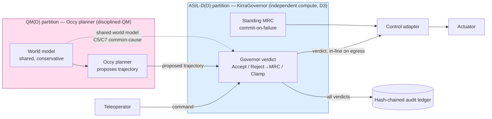
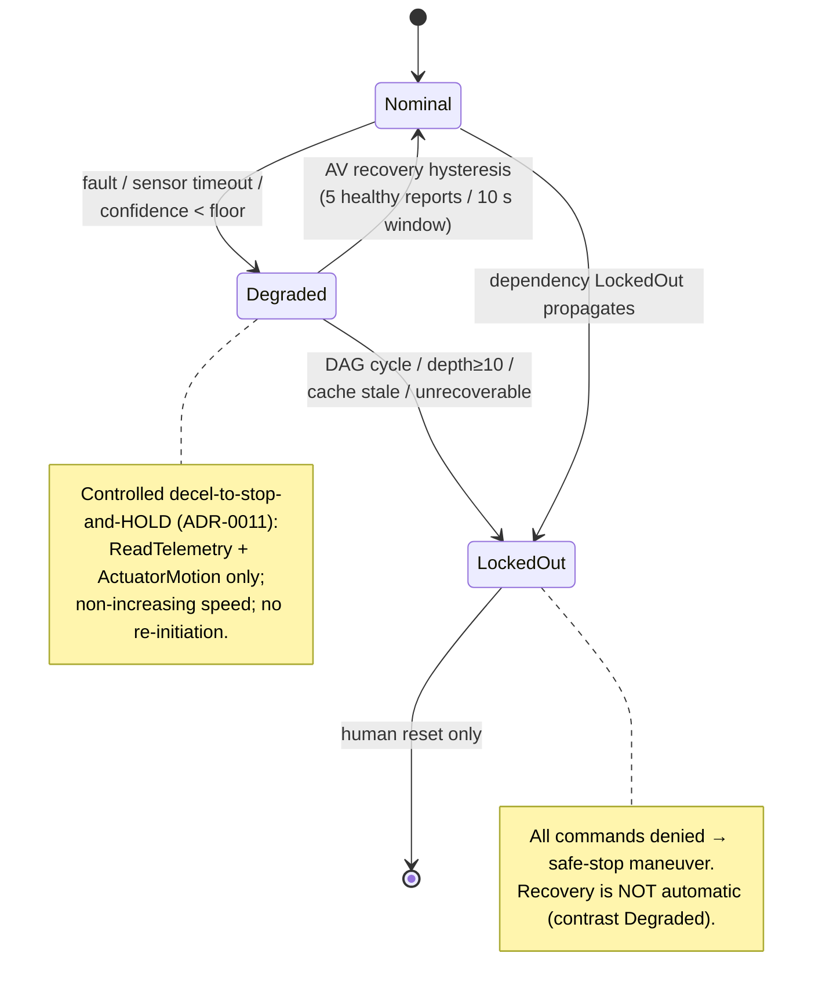

# Kirra / Occy — ISO 26262-9 ASIL Decomposition (consolidated work product)

**Doc ID:** KIRRA-OCCY-ASIL-DECOMP-001
**Standard basis:** ISO 26262-9:2018 Cl.5 (ASIL decomposition) + Cl.7 (dependent
failure analysis).
**Status:** Evidence consolidation for safety-assessor review. This document
introduces **no new requirements, ASIL ratings, or claims.** It is a navigable
synthesis of the already-authored, already-implemented decomposition artifacts —
`OCCY_DFA.md` (the canonical decomposition + DFA) at its core, with the safety
goals, freedom-from-interference evidence, fault model, timing evidence, and
assumptions-of-use linked as supporting evidence. Every claim below cites an
existing document with an exact file path; where a rating or judgment is an
assessor responsibility, the source document that says so is named rather than
restated as settled.

> **Scope guard.** If a statement here ever conflicts with one of the cited
> source documents, the **source document governs** and this consolidation is
> wrong. The canonical decomposition is `docs/safety/OCCY_DFA.md`
> (KIRRA-OCCY-DFA-001); the canonical Occy safety goals are
> `docs/safety/OCCY_SAFETY_GOALS.md` (KIRRA-OCCY-SG-001); the canonical kernel
> safety goals are `docs/safety/SAFETY_GOALS.md` (AEGIS-SG-001).

---

## 0. Document map — what L4 requires and where it lives

| L4 artifact | Section here | Canonical source (governs) |
|---|---|---|
| Hazard analysis reference | §1 | `OCCY_SAFETY_GOALS.md` §3 (HARA) / §5 (STPA); `HARA.md` |
| Safety goals + ASIL allocation | §2 | `OCCY_SAFETY_GOALS.md` §4; `SAFETY_GOALS.md` (AEGIS-SG-001) |
| The ASIL decomposition itself | §3 | `OCCY_DFA.md` §1 |
| Diagnostic-coverage proof obligation (PO-1) | §4 | `OCCY_DFA.md` §2 |
| Freedom from interference (PO-2 / DFA) | §5 | `OCCY_DFA.md` §3, §5; `OCCY_FFI_EVIDENCE.md` |
| Fault containment regions / coupling factors | §6 | `OCCY_DFA.md` §3 (C1–C12); `OCCY_FAULT_MODEL.md` |
| Timing assumptions (FTTI / WCET) | §7 | `OCCY_SAFETY_GOALS.md` §4.1; `src/wcet_gate.rs`; `WCET_MEASUREMENT_METHODOLOGY.md` |
| Safety mechanisms inventory | §8 | `OCCY_DFA.md` §2; `GOVERNOR_SAFETY_MANUAL.md` |
| Allocation table (element ↔ ASIL ↔ SG) | §9 | `OCCY_SAFETY_GOALS.md` §6 |
| Failure-mode analysis (fail-closed) | §10 | `HYPERVISOR_CONTRACT_CHANNEL.md` §4; `OCCY_FAULT_MODEL.md` |
| Assumptions of use | §11 | `ASSUMPTIONS_OF_USE.md`; `OCCY_FFI_EVIDENCE.md` §6 |
| Traceability matrix | §12 | `OCCY_SAFETY_GOALS.md` §6; `RTM_GAP_REPORT.md` |
| Diagrams (boundary / state / sequence) | §13 | this consolidation (renders the above) |

---

## 1. Hazard analysis reference

The decomposition is grounded on the item-level HARA + STPA derivation in
`docs/safety/OCCY_SAFETY_GOALS.md`. Key inputs that drive the ASIL allocation
(quoted facts, not new judgments):

- **Item** (`OCCY_SAFETY_GOALS.md` §1): the automated driving function for the
  Phase-1 ODD — lane keeping, stopping, minimal-risk maneuvering — composed of
  Occy (planner / *doer*), KirraGovernor (runtime checker / *safety monitor*),
  world model, control adapter, MRC family, teleoperator path, fleet posture.
- **Controllability basis** (`OCCY_SAFETY_GOALS.md` §1): driverless operation →
  **C3 (uncontrollable)** for essentially all hazards. "This is the single
  biggest ASIL driver and is what pushes the core driving hazards to ASIL D."
- **HARA** (`OCCY_SAFETY_GOALS.md` §3): hazards H1–H10 → safety goals SG1–SG9.
- **STPA** (`OCCY_SAFETY_GOALS.md` §5): unsafe control actions UCA-1…UCA-7 on the
  Governor's *verdict*, with loss scenarios → safety constraints.

The kernel-scope HARA is `docs/safety/HARA.md` (AEGIS-HARA-001), the input to the
16-goal AEGIS-SG-001 scheme (§2.2 below).

> **Assessor note carried verbatim from the source** (`OCCY_SAFETY_GOALS.md`
> header): the HARA/STPA is "a methodologically sound *draft* … not a certified
> analysis; ASIL ratings and S/E/C judgments must be confirmed by a qualified
> safety assessor before any formal safety-case use." This consolidation does not
> upgrade that status.

---

## 2. Safety goals + ASIL allocation

### 2.1 Occy planner-item goals (`OCCY_SAFETY_GOALS.md` §4)

| SG | ASIL | Goal (abbrev.) | Enforcing element | Safe state |
|----|------|----------------|-------------------|------------|
| SG1 | **D** | No longitudinal collision (RSS-safe distance) | Governor (RSS over horizon) | stop short |
| SG2 | **D** | No departure of drivable area / oncoming / curb | Governor (per-step kinematics + drivable-space) | stop short / pull over |
| SG3 | **D** | No kinematics beyond safe dynamic envelope | Governor (per-step kinematics contract; clamp) | clamp / stop |
| SG4 | **B** (active) | No entry into standing water of unverified depth | Governor (`WATER_UNTRAVERSABLE`) | stop short of water |
| SG5 | **B** | No entry/stop in a high-consequence commit zone without clearance | Governor (map-anchored `COMMIT_ZONE_BLOCKED`) | stop short of zone |
| SG6 | **A** (elevated rigor) | After a collision with unconfirmed clearance, immobilize | Governor (post-collision latch + motion veto) | immobilize in place |
| SG7 | **D** (inherited) | Teleop commands get the same checks as planner commands | Governor (doer-agnostic check) | as SG1–SG3 |
| SG8 | **D** | Always a reachable MRC; commit on any failure/timeout/stale | planner (standing MRC) + control adapter (commit-on-failure) | context-appropriate MRC |
| SG9 | **D** | The safety check fails closed (fault/timeout/non-finite → reject) | Governor (bounded WCET, NaN trap, fail-closed timeout) | reject → MRC |

ASIL determination basis (`OCCY_SAFETY_GOALS.md` §2): with C3 and S3, E4→D,
E3→C, E2→B, E1→A. SG6 priority-vs-ASIL note (`OCCY_SAFETY_GOALS.md` §7): rated
ASIL A by exposure but developed to elevated rigor because its severity is
catastrophic ("ASIL governs development rigor, not deployment priority").

### 2.2 Kernel goals (`SAFETY_GOALS.md`, AEGIS-SG-001 v1.0.0)

The kernel scheme is the broader 16-goal set (AV + UGV + robot + drone +
industrial + fabric). ASILs as defined in `SAFETY_GOALS.md`:

| SG | ASIL | Title |
|----|------|-------|
| SG-001 | D | Velocity Envelope Enforcement |
| SG-002 | D | Lateral Acceleration Envelope Enforcement |
| SG-003 | D | Sensor Timeout Fault Detection |
| SG-004 | C | NaN and Inf Rejection |
| SG-005 | D | Posture Cache Staleness Fail-Closed |
| SG-006 | D | Unknown Command Denial in All Posture States |
| SG-007 | D | Cross-Asset Fleet Lockout Propagation |
| SG-008 | D | Process Fail-Closed on Crash |
| SG-009 | B | HA Standby Promotion Within `PROMOTION_TIMEOUT_MS` |
| SG-010 | B | Audit Chain Tamper Detection |
| SG-011 | C | CANopen NMT State Change Triggers Posture Recalculation |
| SG-012 | B | DNP3 Broadcast Command Mandatory Audit |
| SG-013 | B | Recovery Hysteresis Streak and Window Enforcement |
| SG-014 | B | Federation Report Replay Prevention |
| SG-015 | B | Admin Token Absent Fail-Closed |
| SG-016 | C | DDS Actuator Topic Volatile Durability |

The authoritative Occy↔AEGIS cross-mapping is `OCCY_SAFETY_GOALS.md` §6.2 (e.g.
Occy SG3 is the umbrella over kernel SG-001 + SG-002; Occy SG9 spans kernel
SG-004 + SG-006 + SG-008 + SG-015). It is not re-derived here.

---

## 3. The ASIL decomposition

The architecture is a **safety-monitor (simplex) pattern**, expressed as an
ISO 26262-9 Cl.5 decomposition of each ASIL-D safety goal (`OCCY_DFA.md` §1):

```
ASIL D  =  ASIL D(D) [KirraGovernor]  +  QM(D) [Occy planner]
```

- The **Governor carries the full ASIL-D integrity.** It is the substantive
  ASIL-D element, *not* a watchdog (`OCCY_DFA.md` §1; `OCCY_SAFETY_GOALS.md` §7).
- The **ML planner is QM** with respect to the safety goals, because any
  hazardous trajectory it emits is detected and mitigated by the Governor.
- This is "the only tractable path — developing an ML planner to ASIL D (or even
  B) is infeasible, so all safety integrity is concentrated in the simpler,
  deterministic, verifiable Governor" (`OCCY_DFA.md` §1).

**Planner rigor — SETTLED: DISCIPLINED-QM** (`OCCY_DFA.md` §1). The planner makes
no ASIL claim but is developed with elevated process discipline as
defense-in-depth: documented requirements traceable to tests, coding standards +
static analysis, systematic regression/scenario testing, controlled change
management, deterministic/replayable behavior. It is explicitly *not* an ASIL
claim, *not* MC/DC on the planner, *not* a qualified planner toolchain — that
integrity-grade rigor stays on the Governor.

**The decomposition is valid only if BOTH proof obligations hold** (`OCCY_DFA.md`
§1): PO-1 diagnostic coverage (§4 below) and PO-2 independence (§5 below).
"Without independence, ISO 26262-9 voids the decomposition and *each* element
would have to meet the full ASIL D."

ADR cross-reference: `docs/adr/0020-doer-invariant-safety-case.md`
(doer-invariant safety case), `docs/adr/0003-two-tier-base-and-d1-addon.md`
(compute separation + D1 detection add-on), `docs/adr/0004-independent-safety-channel.md`.

---

## 4. PO-1 — Diagnostic coverage

The Governor must catch every hazardous-trajectory class implied by SG1–SG9.
Coverage map, verbatim from `OCCY_DFA.md` §2:

| Hazard class | Governor check | Covered? |
|---|---|---|
| Longitudinal collision (SG1) | RSS over horizon | yes (lat. pending Ph3) |
| Road/lane departure (SG2) | per-step kinematics + drivable space | yes |
| Dynamic envelope (SG3) | per-step kinematics contract | yes |
| Untraversable water (SG4) | `WATER_UNTRAVERSABLE` | yes |
| Commit zone (SG5) | map-anchored block | yes (depends on localization — C6) |
| Post-collision motion (SG6) | impact latch + veto | yes |
| Teleop unsafe command (SG7) | doer-agnostic check | yes |
| MRC reachability (SG8) | standing-MRC + commit-on-fail | yes |
| Fail-closed (SG9) | WCET / NaN / timeout | yes (bound via S3) |
| **Occlusion / limited visibility** | — | **GAP → G1 (#122)** |

**Known coverage hole** (`OCCY_DFA.md` §2): occlusion-aware caution (G1, #122).
"PO-1 is only as complete as this list; new hazards (S4 catalog) must each get a
Governor check or be excluded from the ODD."

> **Implementation status note.** The occlusion-aware junction speed bound is
> since implemented (`docs/adr/0016-occlusion-aware-junction-speed-bound.md`;
> `behavior::OccludedApproach`, per CLAUDE.md "gap #1"). The canonical PO-1 gap
> table in `OCCY_DFA.md` §2 still lists G1 as open pending assessor
> re-evaluation; this consolidation flags the implementation but does not
> unilaterally close the gap — closure is `OCCY_DFA.md` §6 decision 4.

---

## 5. PO-2 — Freedom from interference (the DFA)

For the Governor to be a valid ASIL-D element, the QM planner must not be able to
defeat or corrupt it, and no common cause may disable both. The three ISO 26262
interference classes (`OCCY_FFI_EVIDENCE.md`, KIRRA-OCCY-FFI-001):

- **Spatial (memory) FFI** (`OCCY_FFI_EVIDENCE.md` §2): Governor + IDC on compute
  separate from the planner (separate SoC preferred; hardware-isolated partition
  the minimum); no shared mutable state; input copy + validation (16 KiB
  body-bound cap, NaN/Inf traps reject non-finite values before the math kernel).
- **Temporal (timing) FFI** (`OCCY_FFI_EVIDENCE.md` §3): no CPU starvation under
  separate compute; bounded verdict WCET + SG9 fail-closed timeout converts any
  budget overrun into Reject→MRC; the audit write is decoupled off the verdict
  path (the whole verdict path is lock-free).
- **Communication (egress) FFI** (`OCCY_FFI_EVIDENCE.md` §4): the Governor sits
  in-line on the actuation egress; no path from planner or teleop to actuators
  bypasses it (SG7 doer-agnostic property); no valid verdict → no Accept → the
  actuator safe-stops (#127 assumption of use).

**Compute-separation decision** (`OCCY_DFA.md` §5): partition-on-shared-SoC
(MPU/hypervisor isolation) is the minimum; **separate SoC** is the strong form
and the only one that fully clears C1/C2/C12.

**The independence differentiator** (`OCCY_DFA.md` §7): C9 (shared
systematic/design faults) is where most architectures are weakest — checker and
planner built in-house by the same team with the same assumptions. KIRRA's
**vendor-independent checker** is the strongest possible mitigation for C9 and a
clean independence argument for C1/C8.

> **FFI residual** (`OCCY_FFI_EVIDENCE.md` §6): D3 separate-compute deployment is
> an **assumption of use**; if violated (Governor co-resident with the planner)
> the FFI argument weakens to partition-isolation only.

---

## 6. Fault containment regions — coupling factors C1–C12

Per ISO 26262-9 Cl.7. Reproduced from `OCCY_DFA.md` §3 (the canonical DFA;
consult it for the full mitigation/residual text). The fault model behind the
fail-closed dispositions is `docs/safety/OCCY_FAULT_MODEL.md`.

| # | Coupling factor | Required mitigation (abbrev.) | Residual |
|---|---|---|---|
| C1 | Shared compute (SoC/core) | spatial+temporal FFI; separate SoC (strong) | low (sep. SoC) / med (partition) |
| C2 | Shared power | independent/monitored Governor power; safe-state on loss | low |
| C3 | Shared memory/state | spatial FFI; immutable validated inputs; no shared mutable state | low |
| C4 | Shared scheduling | temporal FFI / separate compute; WCET bound (S3) | low (fail-closed) |
| **C5** | **Shared perception / world model** | tier-dependent: base conservative re-derivation (uncertainty only) + Perception Input Contract; +D1 add-on closes omission unilaterally | **HIGH — see §6.1** |
| **C6** | **Shared localization (G2)** | localization-confidence gating; degrade on low confidence (#123) | med until G2 |
| C7 | Shared sensors | base: shared w/ integrator (AoU); +D1: dedicated diverse sensing | base: high; +D1: low |
| C8 | Shared software/libraries | minimize shared safety-path code; develop Governor path independently; diverse impl | med |
| C9 | Shared systematic/design | design/process diversity; independent review; **KIRRA vendor-independence** | low w/ independence |
| C10 | Shared egress/comms | Governor in-line on egress; no bypass | low |
| C11 | Cascading (planner crashes checker) | input validation; bounded processing; fail-closed (body-bound, NaN-trap) | low |
| C12 | Environmental | automotive qual; separate placement if co-located | low |

### 6.1 Central finding — the shared world model (C5/C7)

This is "the finding that changes the plan" (`OCCY_DFA.md` §4). The key
distinction: **conservative bounds mitigate UNCERTAINTY, not OMISSION.** You can
widen a detected-but-imprecise object's bounds, but "you cannot be conservative
about something you cannot see" — an object/water/VRU never detected at all is a
shared blind spot, the highest-severity failure mode.

Two valid dispositions (`OCCY_DFA.md` §4.1 / ADR-0003):

- **Base (no D1):** omission common-cause mitigated by conservative checking +
  the Perception Input Contract + envelope-bounding to the integrator's coverage.
  Residual = **delegated** to the perception provider as an explicit
  assumption-of-use (standard SEooC disposition; ASIL-D claim conditional on the
  contract).
- **+ D1 add-on (Tier 2):** omission common-cause **closed unilaterally** by
  KIRRA's own diverse sensing (radar + thermal + optical-for-water) on the
  Governor's independent compute; residual reduces to D1's characterized FP/FN.

The implemented perception-divergence monitor (True-Redundancy `cross_check` →
MRC-floor cap; `docs/adr/0018-perception-divergence-monitor.md`, CLAUDE.md "gap
#2b") is the cross-check half of this disposition.

---

## 7. Timing assumptions — FTTI and WCET

**FTTI policy** (`OCCY_SAFETY_GOALS.md` §4): absolute FTTI depends on closing
dynamics, ODD, and vehicle limits, so the goals give FTTI as *form*. The
load-bearing identity: **"FTTI minus actuation latency IS the Governor WCET
budget S3 must prove."**

**The chain inequality** that the timing argument must satisfy (`OCCY_SAFETY_GOALS.md`
§4.1; `WCET_MEASUREMENT_METHODOLOGY.md`):

```
verdict_WCET  +  actuation_latency  <  control_cycle  <  0.5 s reaction budget
```

**WCET bound** (`src/wcet_gate.rs`; cited in `OCCY_SAFETY_GOALS.md` §4 SG9):

| Constant (`src/wcet_gate.rs`) | Value | Role |
|---|---|---|
| `GOVERNOR_VERDICT_WCET_TARGET_MICROS` | 100 µs | deployment target |
| `GOVERNOR_VERDICT_WCET_CI_THRESHOLD_MICROS` | 1000 µs | CI regression gate (hardware-noise-tolerant) |
| `GOVERNOR_CONTAINMENT_WCET_CI_THRESHOLD_MICROS` | 10 000 µs | SG2 containment path (structurally heavier) |
| `GOVERNOR_PERCEPTION_GUARD_WCET_CI_THRESHOLD_MICROS` | 10 000 µs | perception-guard path |

The CI gate measures **steady-state p99.9, not max** (`src/wcet_gate.rs`: "F7:
the gate is p99.9, not max"), consistent with measurement-based timing evidence.

**Host-vs-target invariant** (`WCET_MEASUREMENT_METHODOLOGY.md`,
KIRRA-OCCY-WCET-METH-001; CLAUDE.md EPIC #270): **host timing is INDICATIVE,
never WCET.** Only QNX-target-under-FIFO numbers feed an FTTI claim; the certified
target-hardware number is re-measured on the D3 independent compute under S8
(#120). `src/wcet_gate.rs` holds the O(1) structural boundedness argument ("a
finite WCET for the verdict path exists by construction") plus the CI guard.

---

## 8. Safety mechanisms inventory

The diagnostic mechanisms that realize PO-1 coverage (Governor checks per
`OCCY_DFA.md` §2; envelope/fail-closed kernel mechanisms per `SAFETY_GOALS.md`;
operational manual `GOVERNOR_SAFETY_MANUAL.md`):

| Mechanism | Realizes | Source / code anchor |
|---|---|---|
| RSS over horizon (§4 conjunction, multi-modal predictive) | SG1 | `crates/kirra-trajectory/src/validation.rs` (`validate_trajectory_slow`, `validate_trajectory_slow_capped`); ADR-0017 |
| Per-step kinematics contract + drivable-space | SG2, SG3 | `crates/kirra-core/src/kinematics_contract.rs` (`validate_vehicle_command`; `src/gateway/kinematics_contract.rs` is a re-export shim) |
| Hard envelope cap before rate limiter | SG-001, SG-002 | `SAFETY_GOALS.md` SG-001 (INV-8) |
| `WATER_UNTRAVERSABLE` / `COMMIT_ZONE_BLOCKED` | SG4, SG5 | `OCCY_DFA.md` §2 |
| Post-collision latch + motion veto | SG6 | `OCCY_DFA.md` §2 |
| Doer-agnostic check (command_source audit-only) | SG7 | `OCCY_SAFETY_GOALS.md` §4 SG7 |
| Standing validated MRC + commit-on-failure | SG8 | `OCCY_SAFETY_GOALS.md` §4 SG8 |
| NaN/Inf trap + bounded WCET + fail-closed timeout | SG9, SG-004 | `crates/kirra-core/src/kinematics_contract.rs` (Priority-0 non-finite guard); `src/wcet_gate.rs` |
| Posture cache staleness → fail-closed | SG-005 | `should_route_command` (`src/posture_cache.rs`) |
| `Unknown` command denial in all postures | SG-006 | `should_route_command` early-return (INV-9) |
| Sensor-timeout watchdog → Degraded/MRC | SG-003 | `src/telemetry_watchdog.rs` |
| Recovery hysteresis (5 streak / 10 s window) | SG-013 | `src/recovery_hysteresis.rs` |
| Hash-chained tamper-evident audit ledger | SG-010 | `src/audit_chain.rs` |
| Degraded = controlled decel-to-stop-and-HOLD | SG8 / ADR-0011 | `enforce_degraded_decel_to_stop` (CLAUDE.md) |

---

## 9. Allocation table (element ↔ ASIL ↔ SG)

Per `OCCY_SAFETY_GOALS.md` §6.1 (project-issue traceability) and the
decomposition (§3). The decomposed elements:

| Safety goal | Goal ASIL | ASIL-D element (D) | QM element (QM) | Independence evidence |
|---|---|---|---|---|
| SG1 longitudinal collision | D | Governor RSS | Occy planner | §5 FFI + §6 DFA |
| SG2 road/lane departure | D | Governor kinematics + drivable-space | Occy planner | §5 + §6 |
| SG3 dynamic envelope | D | Governor per-step contract / clamp | Occy planner | §5 + §6 |
| SG7 teleop parity | D (inherited) | Governor doer-agnostic | teleop source | §5 (C10 egress) |
| SG8 MRC reachability | D | control adapter (commit-on-failure) | planner (standing MRC) | §6 (C4/C11) |
| SG9 fail-closed | D | Governor WCET/NaN/timeout | — (intrinsic to checker) | §7 timing FFI |
| SG4 water / SG5 commit-zone | B (active) | Governor map-/state-anchored | Occy planner | §6 (C5/C6 caveat) |
| SG6 post-collision | A (elevated) | Governor latch + veto | Occy planner | §6 |

In each ASIL-D row the **substantive ASIL-D(D) integrity lives in the Governor**;
the planner is the QM(D) doer (`OCCY_DFA.md` §1; `OCCY_SAFETY_GOALS.md` §7). SG8
is the one goal whose enforcement is split — the planner owns the *standing MRC*,
the control adapter owns *commit-on-failure*.

---

## 10. Failure-mode analysis (every mode fail-closed)

The contract-channel failure semantics (`HYPERVISOR_CONTRACT_CHANNEL.md` §4,
KIRRA-OCCY-HVCHAN-001) — each row names detection point, verdict (always
fail-closed), and the owning barrier under the #279 attribution taxonomy:

| Fault | Detection point | Verdict | Owning barrier |
|---|---|---|---|
| `layout_version` mismatch | governor, first check | reject; no parse | contract-discipline |
| `magic` wrong | governor, prefix check | reject (corrupt region) | contract-discipline |
| Generation retry-exhaustion | snapshot loop | reject after `MAX_SNAPSHOT_RETRIES` | contract-discipline |
| CRC fail | governor edge | reject | contract-discipline |
| Bounds (`command_len` oversize) | governor edge | reject | contract-discipline |
| Judge reject (deadline / kinematic / contract) | governor judge | reject | judge |
| Stale / equal generation or sequence | governor judge (`<=` rule) | reject (replay/regress) | judge |
| Clock skew beyond bound | governor freshness check | reject | hypervisor / contract-discipline |
| Cross-domain timestamp (clock-domain mixing) | governor domain-tag check | reject | contract-discipline |
| Publisher silent | governor liveness watchdog | SG-003 Degraded → MRC | hypervisor + governor |

**Attribution rule** (`HYPERVISOR_CONTRACT_CHANNEL.md` §4, from #279): "a fault
absorbed by the *wrong* layer is a finding, not a pass." The deeper fault model
(latent vs. detected, single vs. multi-point) is `OCCY_FAULT_MODEL.md`.

---

## 11. Assumptions of use

The decomposition's validity is conditioned on assumptions the integrator must
honor. Canonical register: `docs/safety/ASSUMPTIONS_OF_USE.md`.

| AoU | Statement | Source |
|---|---|---|
| D3 separate compute | The Governor runs on compute separate from the planner; co-residence weakens FFI to partition-isolation only | `OCCY_FFI_EVIDENCE.md` §6 |
| Perception Input Contract (base tier) | Without the D1 add-on, omission-class residual is delegated to the integrator's perception provider | `OCCY_DFA.md` §4.1; ADR-0003 |
| Actuation safe-stop (#127) | No valid verdict → actuator safe-stops; absence cannot leak an unchecked command | `OCCY_FFI_EVIDENCE.md` §4 |
| AOU-TIMESYNC-001 | Integrator timestamps synchronized/monotonic and converted to the boundary clock domain before publish | `ASSUMPTIONS_OF_USE.md`; HVCHAN §5 |
| AOU-HW-QNX-TARGET-001 | Certified WCET requires the QNX safety-partition target; host numbers are indicative | `WCET_MEASUREMENT_METHODOLOGY.md`; CLAUDE.md EPIC #270 |
| G2 localization | Integrator localization ≤ 0.10 m 95th-pct lateral error (else conservative 0.75 m fallback) | `OCCY_SAFETY_GOALS.md` §4 SG2; `OCCY_SG2_MARGIN.md` |
| `KIRRA_VEHICLE_CLASS` | Deployment vehicle class set (fail-closed; no default) — selects the per-class kinematic contract | CLAUDE.md env table; `docs/CONTRACT_PROFILES.md` |

---

## 12. Traceability matrix

Goal → enforcing element → verification artifact, from `OCCY_SAFETY_GOALS.md`
§4.1 / §6.1. Open-gap status: `docs/safety/RTM_GAP_REPORT.md`.

| SG | ASIL | Enforcing element | Verification artifact | Sets S3 budget? |
|----|------|-------------------|------------------------|-----------------|
| SG1 | D | Governor RSS | scenario suite + injection (#92) | yes |
| SG2 | D | Governor kinematics + drivable-space | drivable-space tests + injection (#92); `OCCY_SG2_MARGIN.md` | yes |
| SG3 | D | Governor per-step contract / clamp | kinematics + clamp tests (#92) | yes |
| SG4 | B | Governor `WATER_UNTRAVERSABLE` | flood demo (#100) + unit tests | indirectly (horizon) |
| SG5 | B | Governor map-anchored | commit-zone demo (#109) + map-prior test | indirectly (horizon) |
| SG6 | A* | Governor latch + veto | post-collision demo (#105) + injection | yes (detection) |
| SG7 | D | Governor doer-agnostic | teleop injection (#112) | yes |
| SG8 | D | planner MRC + adapter commit | invariant + commit-on-failure tests | partially |
| SG9 | D | Governor WCET/NaN/timeout | NaN/timeout/fault tests + `wcet_gate::ci_gate_tests` | DEFINES it |
| (independence) | D | doer/checker decomposition + DFA | this doc + `OCCY_DFA.md` (#114) | — |

Code-tag convention (`OCCY_SAFETY_GOALS.md` §6.2): `Safety:` traceability tags in
source reference either `SG-NNN` (kernel) or `SGN` (Occy). The enforced/pending/
delegated SG split is tracked in the codebase traceability gate
(`ENFORCED_SGS` / `PENDING_SGS` / `DELEGATED_SGS`).

---

## 13. Diagrams

### 13.1 Safety boundary — doer / checker / egress



The dotted edge is the C5/C7 shared-world-model common cause (§6.1). The Governor
is in-line on the actuation egress — there is no bypass path (§5 communication
FFI). Source: `OCCY_SAFETY_GOALS.md` §1/§5; `OCCY_DFA.md` §3–§5;
`OCCY_FFI_EVIDENCE.md`.

### 13.2 Fleet posture state machine



Source: CLAUDE.md "should_route_command" / "Degraded = Controlled
Decel-to-Stop-and-HOLD" / "AV Recovery Hysteresis"; `src/posture_cache.rs`;
`src/recovery_hysteresis.rs`; `docs/adr/0011-degraded-http-actuator-503-vs-decel-gate.md`.

### 13.3 Contract-channel verdict — the 7-step trust chain

```mermaid
sequenceDiagram
    participant P as Publisher (QM planner partition)
    participant R as Shared region (read-only to governor)
    participant G as Governor (ASIL-D partition)
    participant A as Actuator interface
    P->>R: 1. write payload, len, crc32, sequence, deadline
    P->>R: 2. seqlock commit (odd→write→even)
    G->>R: 3. read gen (even) → copy struct → re-read gen
    Note over G: odd or changed ⇒ retry (bounded) ⇒ fail-closed
    G->>G: 4. validate local copy: bounds → CRC → judge (seq<=last ⇒ reject)
    G->>G: 5. digest over validated snapshot bytes
    G->>A: 6. release token = digest signed (Ed25519, existing machinery)
    A->>A: 7. verify signature + digest match ⇒ release; else NO release
```

Source: `HYPERVISOR_CONTRACT_CHANNEL.md` §3 (the seven normative steps) + §3.1
(generation/sequence `<=` discipline). The closed claim: "the governor approved
exactly the data represented by this digest, and actuator release is
cryptographically bound to that approval."

---

## 14. Open items (owner sign-off, carried from sources — not new)

From `OCCY_DFA.md` §6 (decisions needing owner sign-off) and `RTM_GAP_REPORT.md`:

1. Pull the independent (ii) detection channel forward to close C5/C7 for
   omission failures (the central finding, §6.1) — or accept the base-tier
   delegated-residual disposition (ADR-0003).
2. Compute-separation level — isolated partition vs. separate SoC (§5).
3. Planner rigor — **settled: disciplined-QM** (`OCCY_DFA.md` §1).
4. Close G1 (#122, occlusion) to complete PO-1 coverage; close G2 (#123) to clear
   C6. (G1 has an implementation, ADR-0016; assessor closure pending — §4.)
5. The HARA/STPA ASIL ratings remain assessor-confirmation items
   (`OCCY_SAFETY_GOALS.md` header).

---

## 15. Cross-reference index

| Document | Doc ID | Role in this decomposition |
|---|---|---|
| `OCCY_DFA.md` | KIRRA-OCCY-DFA-001 | **Canonical** decomposition + DFA (the core) |
| `OCCY_SAFETY_GOALS.md` | KIRRA-OCCY-SG-001 | Occy HARA/STPA + SG1–SG9 + ASIL allocation |
| `SAFETY_GOALS.md` | AEGIS-SG-001 | Kernel SG-001…SG-016 |
| `HARA.md` | AEGIS-HARA-001 | Kernel hazard analysis |
| `OCCY_FFI_EVIDENCE.md` | KIRRA-OCCY-FFI-001 | Spatial/temporal/communication FFI (PO-2) |
| `OCCY_FAULT_MODEL.md` | — | Fault model behind C1–C12 / fail-closed |
| `HYPERVISOR_CONTRACT_CHANNEL.md` | KIRRA-OCCY-HVCHAN-001 | Contract-channel trust chain + failure semantics |
| `WCET_MEASUREMENT_METHODOLOGY.md` | KIRRA-OCCY-WCET-METH-001 | Timing-evidence strategy (host vs. target) |
| `ASSUMPTIONS_OF_USE.md` | — | Integrator assumptions of use |
| `GOVERNOR_SAFETY_MANUAL.md` | KIRRA-OCCY-MANUAL-001 | Operational safety manual |
| `RTM_GAP_REPORT.md` | — | Requirements-traceability gap status |
| `src/wcet_gate.rs` | — | WCET constants + structural boundedness + CI guard |
| ADR-0003 / 0004 / 0006 / 0011 / 0016 / 0017 / 0018 / 0020 | — | Decomposition & enforcement decisions |

**Register as KIRRA-OCCY-ASIL-DECOMP-001.** This document is a consolidation; the
cited sources govern on any conflict.
